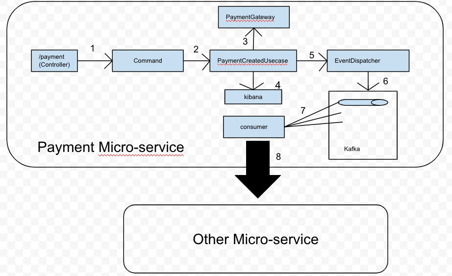
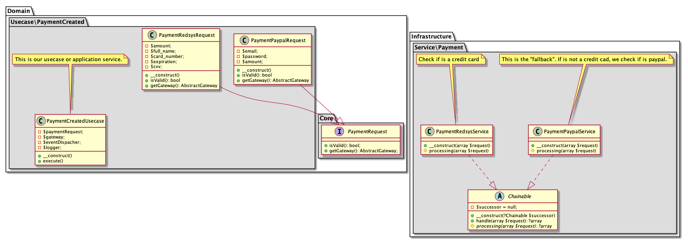

# Porposal

- We define **one endpoint: https://{url}/payments (POST)**

- This endpoint will be able to receive different kind of json requests.

- Using the **"chain of responsibility"** pattern we can identify which type of billing method we want to use. (is the data sent is not related to billing data that we expect, the system will throw an especific exception) *(step 1 block diagram)*

- Once is identified which "command" we have, we can call our usecase using the proper gateway. *(step 2 block diagram)*

- The **usecase has logger and event dispacher thanks to "dependency inversion pattern"**

- In the usecase, we will validate that all the information that inside our command is valid (all fields required, credit card not expired, etc.)

- If everything is valid, we send that command to third party gateway service (redsys, paypal, etc). The third party service will do something and then it'll send us a callback with some result. *(step 3 block diagram)*

- If the callback contains some error, we will notify the user and log that error. All logs will be send on Kibana in order to analyze what is happening. *(step 4 block diagram)*

- If the **callback is correct**, first we will **create a new register on database** with all the information of that payment **and after that, we will dispatch an event** that it say that the payment is done. *(step 5 block diagram)*

- Then a listener will catch that message and will **send that message to a queue system** (for example, kafka) *(step 6 block diagram)*

- Then **we will have consumers** (probably made in java) that will consume this message from the topic. *(step 7 block diagram)*

- **The consumer** will adapt the information and then, it **will send that information to other microservice** using and api call to notify that the payment is done. *(step 8 block diagram)*

### Considerations:
- we use chain of responsibility to decouple sender of a request and receiver of the request.

- I choose kafka as a queue system in order to have more configuration options and performance than other queue systems. However, kafka does not have a good implementation in php, for this reason the consumer would be build in java

- To verify that the system works, we will do some unit and functional test. As is it known, we should try to have more unit test than functional test.

### Block Design:

### Entity Relation Diagram

